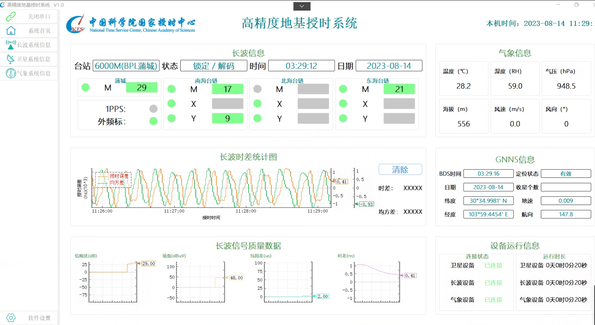
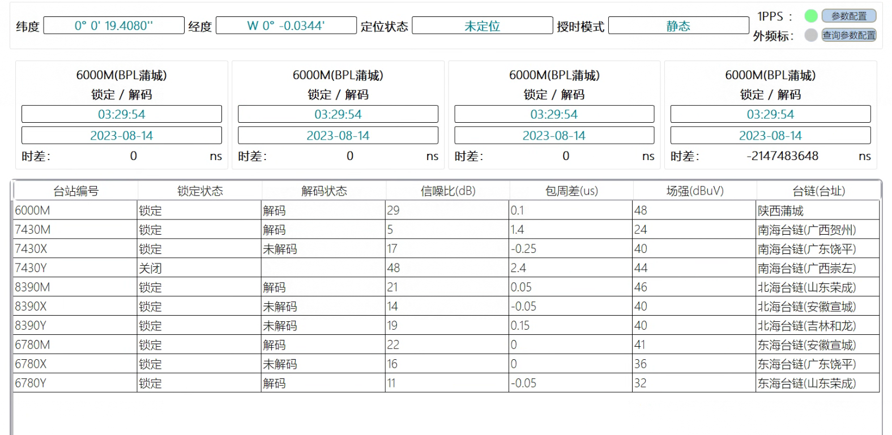
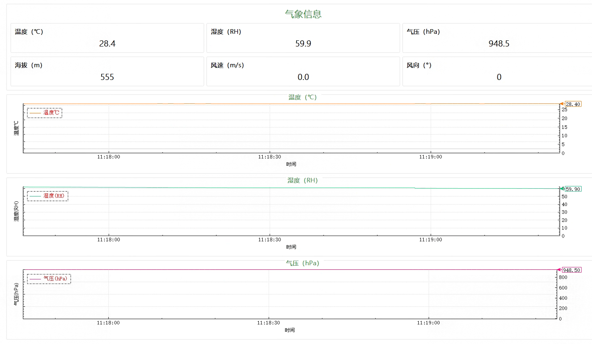
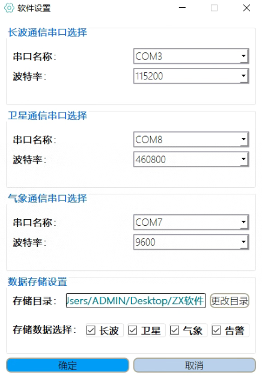
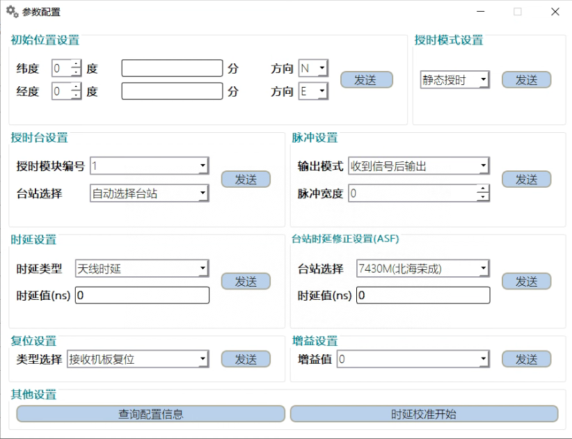
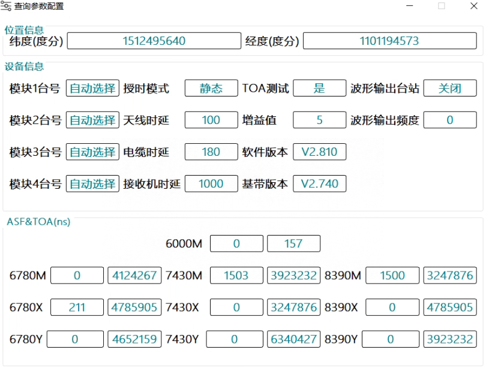

# 增强型罗兰基准服务采集软件
移动端功能主要为将天线测量的经纬度、长波信息、气象信息等数据通过分析串口协议，显示至桌面端。

### 1  GNNS信息获取

**功能描述：** 差分站信号测量与数据采集处理软件GNNS信息获取功能主要用于获取以下GNNS信息：UTC时间、日期、纬度、经度、定位状态、收星个数、地速和航向。

**输入：** GNNS卫星信号。

**输出：** 
- UTC时间
- 日期
- 纬度
- 经度
- 定位状态
- 收星个数
- 地速和航向
- 定位信息统计图

**流程分析：** 
1. 系统接收GNNS卫星信号。
2. 系统解析卫星信号，提取以下信息：
   - UTC时间
   - 日期
   - 纬度
   - 经度
   - 定位状态
   - 收星个数
   - 地速和航向
3. 系统将提取的信息显示在相应的界面上。

### 2 长波信息获取

**功能描述：** 该功能用于获取并显示长波信息，包括台站、状态、时间、BPL和台链。这些信息将以可视化方式呈现给用户，界面如下所示：

**输入：** 系统通过长波信号接收设备获取长波信息。这些信息可能包括：
- 台站名称
- 状态（在线或离线）
- 时间
- BPL和台链等

**输出：** 软件将根据接收到的长波信息，在用户界面上显示：
- 台站名称
- 状态
- 时间
- BPL和台链等信息

**流程分析：** 
1. 系统启动并初始化长波信号接收设备。
2. 接收设备开始监听长波信号，并解析接收到的长波信息。
3. 系统从接收设备中读取长波信息，并提取台站名称、状态、时间、BPL和台链等内容。
4. 提取出的长波信息将显示在用户界面上，以方便用户查看。

### 3 气象信息获取

**功能描述：** 该功能用于获取并显示温度、湿度、气压、海拔、风速、风向等气象信息，并将这些信息呈现给用户。界面如下所示：

**输入：** 通过串口获取以下气象信息：
- 时间
- 温度
- 湿度
- 气压
- 海拔
- 风速
- 风向

**输出：** 软件将根据接收到的气象信息报文，在用户界面上显示：
- 时间
- 温度
- 湿度
- 气压
- 海拔
- 风速
- 风向

**流程分析：** 
1. 系统启动并初始化气象信号接收设备。
2. 接收设备开始监听气象信号，并解析接收到的气象信息。
3. 系统从接收设备中读取气象信息，并提取时间、温度、湿度、气压、海拔、风速、风向等信息。
4. 提取出的气象信息将显示在用户界面上，以便用户查看。

### 4  设备运行信息获取

**功能描述：** 设备运行信息获取功能用于获取并显示卫星设备状态、长波设备状态以及气象设备状态。这提供了一种快速查看设备运行状态的方式，以便用户能够及时了解设备的工作情况。

**输入：** 通过串口获取设备运行信息报文。

**输出：** 该功能将显示GNNS、长波和气象采集设备的运行状态，包括连接状态和运行时长。

**流程分析：** 
1. 软件调用设备运行信息功能模块，与卫星设备模块、长波设备模块以及气象设备模块进行通信。
2. 获取卫星设备模块、长波设备模块以及气象设备模块的状态信息。
3. 将获取的设备状态信息显示在用户界面上，以便用户查看。

###5 长波信号质量数据获取

**功能描述：** 该功能用于获取并显示长波信号质量数据，包括信噪比、场强、包周差和时差。此外，该功能还提供生成长波时差统计图的功能，界面如下所示：

**输入：** 从长波设备模块获取的信噪比、场强、包周差和时差数据。

**输出：** 
- 信号质量信息：将信噪比、场强、包周差和时差数据显示在用户界面上。
- 长波时差统计图：生成长波时差统计图，并将其显示在用户界面上。

**流程分析：** 
1. 软件调用设备运行信息功能模块，与长波设备模块进行通信。
2. 获取长波信号质量数据，包括信噪比、场强、包周差和时差。将获取的数据存储在内部变量中。
3. 生成界面显示数据，将信噪比、场强、包周差和时差数据显示在用户界面上。
4. 根据获取到的长波时差数据生成统计图。
5. 将统计图显示在用户界面上，以供用户查看。

### 6 软件配置

**功能描述：** 软件配置功能包括以下子功能：
1. **软件设置：** 包括长波通信串口选择、卫星通信串口选择、气象通信串口选择。串口选择涵盖串口名称和波特率的选择。此外，软件设置还包括数据存储目录设置，允许用户选择在长波数据、卫星数据、气象数据和告警信息中存储哪些信息。数据存储目录设置将以INI配置文件的形式保存到本地，以便在软件重新打开后读取配置信息。界面如下图所示：

   

2. **长波参数配置：** 长波参数配置包括以下设置项：
   - 初始位置设置
   - 授时模式设置
   - 授时台设置
   - 脉冲设置时延设置
   - 台站时延修正设置 (ASF)
   - 复位设置
   - 增益设置

   上述设置将通过向串口发送报文实现。其他设置还包括查询配置信息和时延校准开始功能。界面如下图所示：

   

3. **长波查询参数配置：** 包括以下信息：
   - 位置信息（经纬度）
   - 设备信息（模块1~4台号、授时模式、天线时延、电缆时延、接收机时延、TOA测试、增益值、软件版本、基带版本、波形输出台站、波形输出频度）
   - ASF&TOA信息（所有台站的ASF和TOA数值）

   界面如下图所示：

   

